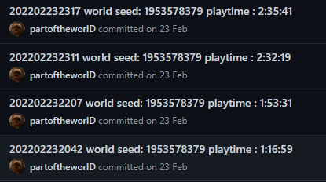

# NoitaHRSC
The powershell script makes commits for more flexible save management, world seed and game time which are taken from the statistics files



# How to use

1. Create a local repository via `git init` in `C:\Users\<username>\AppData\LocalLow\Nolla_Games_Noita\save00` folder.

2. Then you will need to add a link to your repository  via `git remote add <name> <link>`. Example:
```bash
git remote add origin https://github.com/partoftheworlD/noita_save
git push -u origin master
```
3. Make a save in Noita. To do this, press Esc, select Mods and press "Restart with enabled mods active". Even if you play without mods, this will restart the game and create a save in the game folder.  
4. Run the script.

---
Check how to create repository on [Github](https://docs.github.com/en/get-started/quickstart/create-a-repo), [Gitlab](https://docs.gitlab.com/ee/user/project/repository/) or [Bitbucket](https://support.atlassian.com/bitbucket-cloud/docs/create-a-git-repository/)
